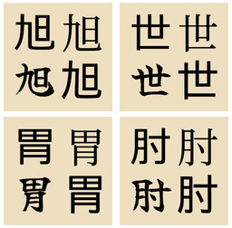

<div align="center">
  
</div>
<h1 align="center">
  日本語 Learning
</h1>
<p align="center">
  <b>
    <a href="https://github.com/julianorchard/benkyo/releases/tag/2200">
      DOWNLOAD THE 2,200 IMAGES HERE!
    </a>
  </b>
</p>

> I initially made these scripts in quite a rush
> to get on with my person studying, but I've
> subsequently had a chance to clean them up a
> little bit! Enjoy...

## What is this?

Remembering The Kanji (RTK) is a method of
learning to recognise the roughly 2,200 Jōyō
kanji, where you [work through a
book](https://en.wikipedia.org/wiki/Remembering_the_Kanji_and_Remembering_the_Hanzi). This repo contains some scripts that generate some
nice looking [Anki
cards](https://apps.ankiweb.net/) which I'm using
to try and learn these characters! It also
contains some of the CSS and HTML used for the
cards. I've used
[ImageMagick](https://imagemagick.org/index.php) to create the kanji
images.

Although I do own a physical copy of the book, the list of kanji I used to make these cards was originally in [this Reddit
post](https://www.reddit.com/r/LearnJapanese/comments/1a126a/all_2200_kanji_from_heisigs_remembering_the_kanji/).

## Running your own

You will obviously only want to run your own
if you want to generate a different set of
characters to learn, otherwise you
can just [download the images I generated...](https://github.com/julianorchard/benkyo/releases/tag/2200)!

With that in mind, if you're aiming to recreate this exact style of
image (for Japanese learning specifically), you
just need to install these:

- [Meiryo](https://docs.microsoft.com/en-us/typography/font-list/meiryo), Microsoft
- [Noto Serif JP](https://fonts.google.com/noto/specimen/Noto+Serif+JP), Google Fonts
- [Yuji Mai](https://fonts.google.com/specimen/Yuji+Mai), Google Fonts
- [BIZ UDGothic](https://docs.microsoft.com/en-us/typography/font-list/biz-udgothic), Microsoft

Then you can run the script called `benkyou` with an
argument pointing at the input file location. For
example, to run mine it's:

```bash
./benkyou src/RTK-2200
```

You can change the output location by editing the
`benkyou` script. It outputs to `output/` by default!

Otherwise you'll have to edit the file in
`src/build.sh` to reference the new fonts you want
to use. Likewise, colours of the images generated
would have to be changed in that file.

